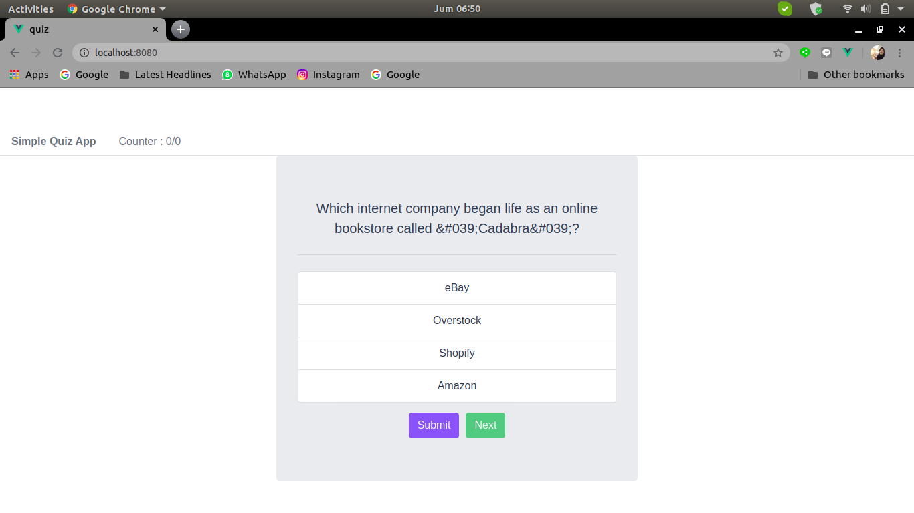
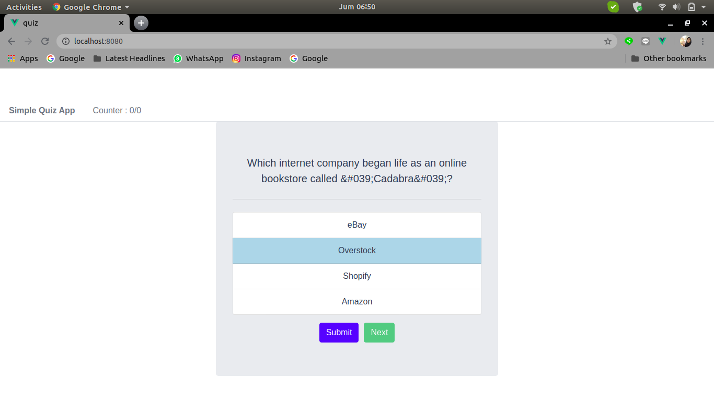
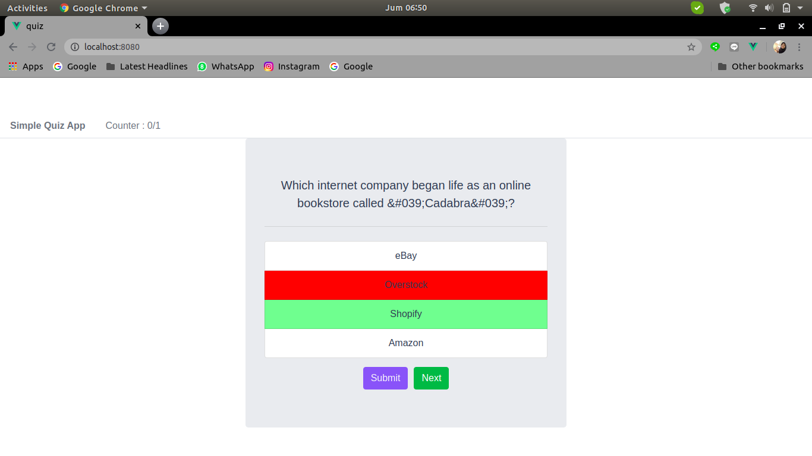
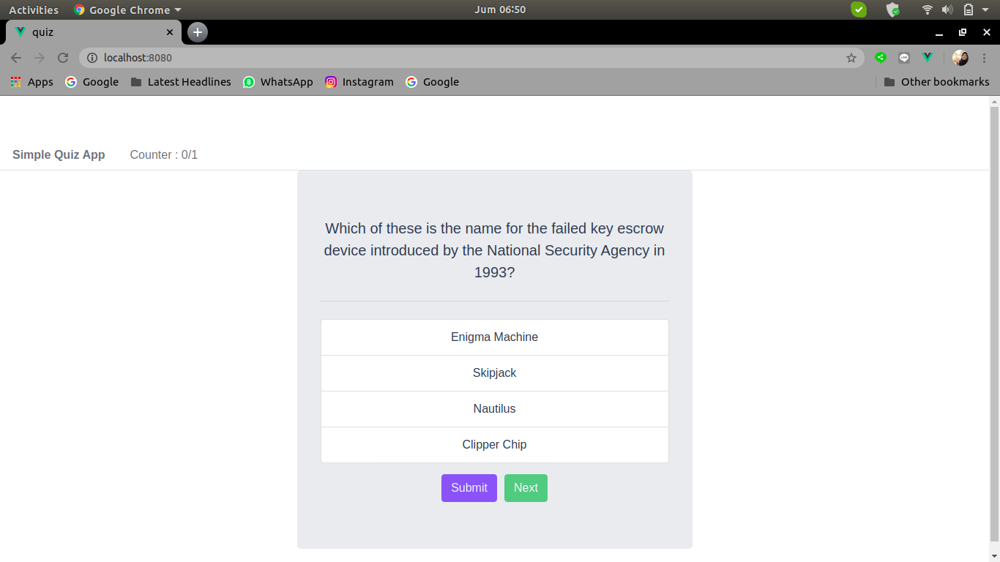

# Quiz-Platform

## About
Quiz-Platform is a simple quiz web aplication created using VueJS. It will fetch all questions from https://opentdb.com and display each questions in Vue components. In this case the questions is about Computer Science.
User of this web aplication can see the question one by one and choose the answer for each question. After user click submit button in each question, aplication will show whether the answer correct or not and aplication will count the number of answered question and number of correct question.

## Instalation and Run The Server
### Install
```
npm install
```
### Compiles and hot-reloads for development
```
npm run serve
```
### Compiles and minifies for production
```
npm run build
```
### Lints and fixes files
```
npm run lint
```
### Customize configuration
See [Configuration Reference](https://cli.vuejs.org/config/).

## Screenshots of Application
### Quiz Platform

### Select The Answer

### Evaluate The Answer

### Increment The Counter
